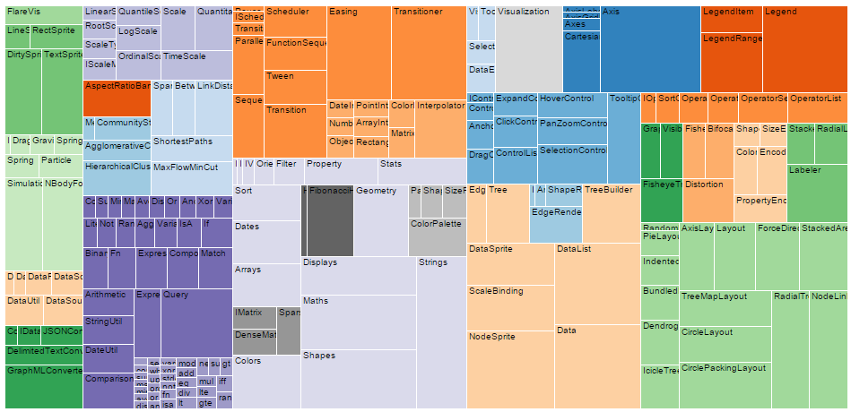

# Treemap

Neste tutorial vamos ensinar os conceitos necessários para construir uma visualização Treemap.
Esse tipo de visualização é apropriada para representar o relacionamento parte/todo quando os dados
possuem uma estrutura hierárquica.
Um Treemap divide a área recursivamente em retângulos, de forma que a área de cada retângulo corresponda ao valor do dado associado, conforme exemplificado na figura abaixo:




## Dados de Exemplo

Antes de começar nosso tutorial, primeiro precisamos de dados. 
Vamos imaginar que estamos interessados em controlar as despesas mensais e saber com que tipo
de coisa gastamos mais dinheiro. Supondo que uma certa pessoa registrou todas as despesas do mês e as organizou em uma hierarquia de categorias, podemos ter dados como exemplificado abaixo.

```javascript
var expenses = {
  "categoria": "Despesas Totais",
  "subitens": [{
    "categoria": "Água",
    "valor": 67.00
  },{
    "categoria": "Energia",
    "valor": 112.00
  },{
    "categoria": "Aluguel",
    "valor": 900.00
  },{
    "categoria": "Alimentação",
    "subitens": [{
      "categoria": "Almoço no Bandejão",
      "valor": 84.00
    },{
      "categoria": "Compra do mês",
      "valor": 316.00
    }]
  },{
    "categoria": "Transporte",
    "subitens": [{
      "categoria": "Gasolina",
      "valor": 250.00
    },{
      "categoria": "Troca de Óleo",
      "valor": 120.00
    },{
      "categoria": "Ônibus",
      "valor": 26.40
    }]
  }]
};
```

Os dados acima estão na notação JSON. Uma característica importante é que eles são organizados em uma hierárquia e apenas os nodos folha possuem valores. O valor dos nodos internos correspondem à soma dos valores de seus descendentes. Com isso, a visualização em Treemap é interessante para visualizar as despesas.


## Construindo um Treemap Básico

Para começar a construir nossa visualização, vamos partir de uma página HTML simples, como exemplificada abaixo:

```html
<html>
<head>
<title>Treemap</title>
<meta http-equiv="Content-Type" content="text/html;charset=utf-8">
</head>
<body>

<script src="../../lib/d3.v3.min.js"></script>
<script src="treemap.js"></script>

</body>
</html>
```

No código acima, temos a estrutura mínima de um documento HTML. Observe que importamos dois arquivos Javascript. O primeiro deles é a própria bilioteca D3.js. O segundo, `treemap.js`, é o código que iremos desenvolver nos passos seguintes.


### Usando Layouts


A API D3 nos provê diversas facilidades para implementar visualizações. Uma dessas facilidades é o conceito de Layouts. Um layout é um objeto responsável por computar as posições e dimensões de cada nodo de um conjunto de dados (veja https://github.com/mbostock/d3/wiki/Layouts). No caso do Treemap, existe a função `d3.layout.treemap()`, que nos retorna um objeto que representa o layout de Treemap. Portanto, vamos iniciar nosso código criando esse objeto:

```javascript
var treemapLayout = d3.layout.treemap();
```

O layout Treemap precisa de conhecer as dimensões da área total disponível para conseguir calcular a posição dos elementos. Para isso, devemos usar o método `treemapLayout.size([width, height])`, onde `width` e `height` são a largura e altura em pixels da área disponível. Além disso, o layout Treemap precisa saber como interpretar nossos dados. Especificamente, devemos fornecer ao layout funções para acessar o valor de um nodo e também os seus nodos filhos. Isso é configurado com as funções `treemapLayout.value` e `treemapLayout.children`. É importante ressaltar que existem diversas outras configurações opcionais que 
podemos passar para o Treemap layout (mais detalhes em https://github.com/mbostock/d3/wiki/Treemap-Layout#treemap).
Para nosso exemplo, a configuração ficaria como a abaixo:

```javascript
var width = 600;
var height = 400;
var treemapLayout = d3.layout.treemap();

treemapLayout.size([width, height]);

treemapLayout.value(function(node) {
  return node.valor;
});

treemapLayout.children(function(node) {
  return node.subitens;
});
```

Feita essas configurações, já podemos usar o layout para computar as posições e dimensões de cada elemento usando a função `treemapLayout.nodes`, passando como parâmetro os nossos dados:

```javascript
var nodes = treemapLayout.nodes(expenses);
```

Se inspecionarmos o resultado dessa chamada, veremos que ela retorna um vetor com um elemento para cada nodo dos nossos dados, onde cada elemento possui os dados abaixo:

```javascript
{
  categoria: "Alimentação",
  subitens: ...
  x: 184,
  y: 0,
  dx: 416,
  dy: 123,
  value: 400,
  area: 51189.07966300523,
  ...
}
```

Observe que, além dos campos que já existiam no JSON original, o layout adiciona nos elementos do vetor os valores computados para a posição (`x` e `y`) e a largura e altura do nodo (`dx` e `dy`), de acordo com o algoritmo do Treemap.
Concluindo, um layout nos ajuda a preparar os dados para exibição, mas não é responsável por exibí-los. Evidentemente, podemos implementar nossa própria lógica para computar as posições em vez de usar layouts prontos disponíveis no D3.


### Criando os Elementos Visuais

Para de fato desenhar os retângulos do Treemap, vamos criar novas tags no corpo da nossa página. A manipulação do DOM (Document Object Model) é feita no D3 usando um estilo parecido com a popular API JQuery. Ou seja, selecionamos um conjunto de elementos e trabalhamos nessa seleção encadeando chamadas de funções. No entanto, o D3 introduz um conceito novo, denominado _data joins_. É importante entender esse conceito para se trabalhar com o D3. Uma introdução ao assunto pode ser encontrada em http://bost.ocks.org/mike/join/ .

Antes de criar os retângulos, precisamos criar um contâiner para eles:

```javascript
var svgTag = d3.select("body").append("svg")
  .attr("class", "treemap")
  .attr("width", width + "px")
  .attr("height", height + "px");
```

No código acima, selecionamos o corpo da página usando a função `d3.select`. Em seguida, adicionamos uma nova tag do tipo SVG dentro da seleção resultante por meio da chamada ao método `append`. A partir daí, a seleção resultante passa a ser a tag SVG. Em seguida encadeamos três chamadas à função `attr`. Essa função define o valor de um atributo para os elementos da seleção. Observe que tal função sempre retorna a própria seleção alvo da chamada. Dessa forma, definimos os atributos `class`, `width` e `height` da tag SVG que criamos.


Especificamente, podemos usar elementos `rect` do SVG, que é um padrão do W3C para desenho vetorial.


