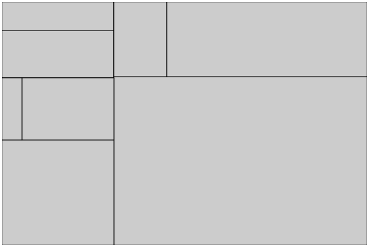
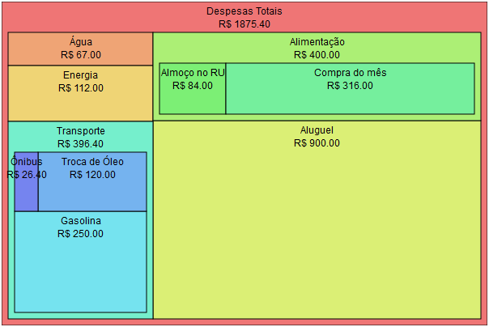

# Criando uma Visualização Treemap

__Autores__: Danilo Ferreira, Guilherme Avelino e Hudson Borges


Neste tutorial vamos ensinar os conceitos necessários para construir uma visualização Treemap.
Esse tipo de visualização é apropriada para representar o relacionamento parte/todo quando os dados
possuem uma estrutura hierárquica.
Um Treemap divide a área recursivamente em retângulos, de forma que a área de cada retângulo corresponda ao valor do dado associado, conforme exemplificado na figura abaixo:


Antes de prosseguir, vale ressaltar que assumimos um conhecimento básico dos seguintes tópicos:
* Programação em Javascript
* HTML e o padrão de desenho vetorial SVG
* Estilos CSS

Caso o leitor não conheça nada sobre algum dos itens acima, recomendamos que procure primeiro outros materiais introdutórios
nos respectivos assuntos. No entanto, nenhum conhecimento em detalhes é exigido para acompanhar este tutorial.  


## Dados de Exemplo

Antes de começar nosso tutorial, primeiro precisamos de dados. 
Vamos imaginar que estamos interessados em controlar as despesas mensais e saber com que tipo
de coisa gastamos mais dinheiro. Supondo que uma certa pessoa registrou todas as despesas do mês e as organizou em uma hierarquia de categorias, podemos ter dados como exemplificado abaixo.

```javascript
var expenses = {
  "categoria": "Despesas Totais",
  "subitens": [{
    "categoria": "Água",
    "valor": 67.00
  },{
    "categoria": "Energia",
    "valor": 112.00
  },{
    "categoria": "Aluguel",
    "valor": 900.00
  },{
    "categoria": "Alimentação",
    "subitens": [{
      "categoria": "Almoço no RU",
      "valor": 84.00
    },{
      "categoria": "Compra do mês",
      "valor": 316.00
    }]
  },{
    "categoria": "Transporte",
    "subitens": [{
      "categoria": "Gasolina",
      "valor": 250.00
    },{
      "categoria": "Troca de Óleo",
      "valor": 120.00
    },{
      "categoria": "Ônibus",
      "valor": 26.40
    }]
  }]
};
```

Os dados acima estão na notação JSON. Uma característica importante é que eles são organizados em uma hierárquia e apenas os nodos folha possuem valores. O valor dos nodos internos correspondem à soma dos valores de seus descendentes. Com isso, a visualização em Treemap é interessante para visualizar as despesas.


## Construindo um Treemap Básico

Para começar a construir nossa visualização, vamos partir de uma página HTML simples, como exemplificada abaixo:

```html
<html>
<head>
<title>Treemap</title>
<meta http-equiv="Content-Type" content="text/html;charset=utf-8">
</head>
<body>

<script src="../../lib/d3.v3.min.js"></script>
<script>
// aqui será feito o código
</script>

</body>
</html>
```

No código acima, temos a estrutura mínima de um documento HTML. Observe que importamos um arquivo Javascript, que é a própria bilioteca D3.js. Em seguinda, temos um tag SCRIPT que conterá o código que iremos desenvolver nos passos seguintes.


### Usando Layouts


A API D3 nos provê diversas facilidades para implementar visualizações. Uma dessas facilidades é o conceito de Layouts. Um layout é um objeto responsável por computar as posições e dimensões de cada nodo de um conjunto de dados (veja https://github.com/mbostock/d3/wiki/Layouts). No caso do Treemap, existe a função `d3.layout.treemap()`, que nos retorna um objeto que representa o layout de Treemap. Portanto, vamos iniciar nosso código criando esse objeto:

```javascript
var treemapLayout = d3.layout.treemap();
```

O layout Treemap precisa de conhecer as dimensões da área total disponível para conseguir calcular a posição dos elementos. Para isso, devemos usar o método `treemapLayout.size([width, height])`, onde `width` e `height` são a largura e altura em pixels da área disponível. Além disso, o layout Treemap precisa saber como interpretar nossos dados. Especificamente, devemos fornecer ao layout funções para acessar o valor de um nodo e também os seus nodos filhos. Isso é configurado com as funções `treemapLayout.value` e `treemapLayout.children`. É importante ressaltar que existem diversas outras configurações opcionais que 
podemos passar para o Treemap layout (mais detalhes em https://github.com/mbostock/d3/wiki/Treemap-Layout#treemap).
Para nosso exemplo, a configuração ficaria como a abaixo:

```javascript
var width = 600;
var height = 400;
var treemapLayout = d3.layout.treemap();

treemapLayout.size([width, height]);

treemapLayout.value(function(node) {
  return node.valor;
});

treemapLayout.children(function(node) {
  return node.subitens;
});
```

Feita essas configurações, já podemos usar o layout para computar as posições e dimensões de cada elemento usando a função `treemapLayout.nodes`, passando como parâmetro os nossos dados:

```javascript
var nodes = treemapLayout.nodes(expenses);
```

Se inspecionarmos o resultado dessa chamada, veremos que ela retorna um vetor com um elemento para cada nodo dos nossos dados, onde cada elemento possui os dados abaixo:

```javascript
{
  categoria: "Alimentação",
  subitens: ...
  x: 184,
  y: 0,
  dx: 416,
  dy: 123,
  value: 400,
  area: 51189.07966300523,
  ...
}
```

Observe que, além dos campos que já existiam no JSON original, o layout adiciona nos elementos do vetor os valores computados para a posição (`x` e `y`) e a largura e altura do nodo (`dx` e `dy`), de acordo com o algoritmo do Treemap.
Concluindo, um layout nos ajuda a preparar os dados para exibição, mas não é responsável por exibí-los. Evidentemente, podemos implementar nossa própria lógica para computar as posições em vez de usar layouts prontos disponíveis no D3.


### Criando os Elementos Visuais

Para de fato desenhar os retângulos do Treemap, vamos criar novas tags no corpo da nossa página. A manipulação do DOM (Document Object Model) é feita no D3 usando um estilo parecido com a popular API JQuery. Ou seja, selecionamos um conjunto de elementos e trabalhamos nessa seleção encadeando chamadas de funções. No entanto, o D3 introduz um conceito novo, denominado _data joins_. É importante entender esse conceito para se trabalhar com o D3. Uma introdução ao assunto pode ser encontrada em http://bost.ocks.org/mike/join/ .

Antes de criar os retângulos, precisamos criar um contâiner para eles:

```javascript
var svgTag = d3.select("body").append("svg")
  .attr("class", "treemap")
  .attr("width", width + "px")
  .attr("height", height + "px");
```

No código acima, selecionamos o corpo da página usando a função `d3.select`. Em seguida, adicionamos uma nova tag do tipo SVG dentro da seleção resultante por meio da chamada ao método `append`. A partir daí, a seleção resultante passa a ser a tag SVG. Em seguida encadeamos três chamadas à função `attr`. Essa função define o valor de um atributo para os elementos da seleção. Observe que tal função sempre retorna a própria seleção alvo da chamada. Dessa forma, definimos os atributos `class`, `width` e `height` da tag SVG que criamos.

Vamos agora criar elementos RECT, dentro do container SVG, para cada nodo de dados:

```javascript
var rects = svgTag.selectAll("rect").data(nodes)

rects.enter().append("rect");

rects
  .attr("x", function(d) {return d.x;})
  .attr("y", function(d) {return d.y;})
  .attr("width", function(d) {return d.dx;})
  .attr("height", function(d) {return d.dy;});
```

Vamos analisar em detalhes o código acima. Primeiro, `svgTag.selectAll("rect")` seleciona todos as tags RECT dentro da tag SVG. Alguém poderia se perguntar porque fazer isso, se sabemos que não existem elementos RECT ainda.
Na verdade, nossa intenção é mapear tags da página aos nodos de dados correspondentes (ou seja, fazer um _data joins_), o que ocorre na chamada `.data(nodes)` que vem em seguida. Essa chamada gerará três seleções de elementos que representam 
três estados possíveis (mais detalhes em http://bl.ocks.org/mbostock/3808218):

* _enter_: representa os dados novos para os quais não existem tags correspondentes na página. No nosso caso, a página estava vazia e todos os dados cairão nessa seleção.
* _update_: representa as tags existentes que foram mapeadas para um nodo de dados. Essa seleção estará vazia. 
* _exit_: representa as tags existentes para as quais não há dados. Essa seleção estará vazia também. Ela só existirá quando houver mais tags do que dados no _join_.

A chamada `rects.enter()` nos permite especificar exatamente o que fazer para a seleção _enter_. No caso, o que queremos é criar a tag RECT para cada nodo do dados.  

Em seguida, usamos a seleção `rects`, que agora corresponde à união das seleções _enter_ e _update_, para atualizar os atributos da tag RECT de acordo com os dados. Isso é feito com várias chamadas a função `attr`, como de costume. No entanto, há uma novidade nessas chamadas. Em vez de passar um valor como segundo parâmetro, estamos passando uma função. Essa função recebe como parâmetro o nodo de dado associado a tag, e podemos usá-lo para obter os valores de `x`, `y`, `dx` e `dy`.

Para finalizar nosso Treemap básico, vamos definir a borda e cor de preenchimento dos retângulos via estilos CSS:
```css
.treemap rect {
  fill: #cccccc;
  stroke: black;
  stroke-width: 1;
}
```

Pronto! Eis o resultado:




## Adicionando Rótulos e Cores

Até agora conseguimos desenhar os retângulos nas posições corretas e com o tamanho desejado. Porém, nossa visualização
ainda tem problemas óbvios como:
* Não sabemos o que cada retângulo representa.
* Não temos noção da hierarquia de categorias.

Para melhorar nosso Treemap, vamos começar adicionando rótulos para identificar os retângulos. Para isso, podemos criar elementos
da seguinte maneira. Criamos um tag G, que representa um grupo de tags, para cada nodo dos dados e dentro dela criamos a tag RECT para o retângulo e uma ou mais tags TEXT para imprimir rótulos. O código reestruturado ficará como o abaixo:

```javascript
var groups = svgTag.selectAll("g").data(nodes).enter().append("g");

groups
  .attr("transform", function(d) {return "translate(" + d.x + "," + d.y + ")";});

groups.append("rect")
  .attr("width", function(d) {return d.dx;})
  .attr("height", function(d) {return d.dy;});

groups.append("text")
  .attr("x", function(d) {return d.dx/2;})
  .attr("y", 16)
  .attr("text-anchor", "middle")
  .text(function(d) {return d.categoria;});

groups.append("text")
  .attr("x", function(d) {return d.dx/2;})
  .attr("y", 32)
  .attr("text-anchor", "middle")
  .text(function(d) {return "R$ " + d.value.toFixed(2);});
```

Observe que a tag G possui o atributo `transform` para aplicar uma translação em todos os elementos contidos no mesmo, para evitar de repetir as posições `x` e `y` do nodo em cada tag. 
Além disso, observe que criamos dois rótulos, um para exibir a categoria e outro para imprimir o valor. Ambos estão posicionados no centro do retângulo, a uma distância fixa do topo.

Por padrão, as areas das categorias filhas sobrepõem totalmente a área da categoria pai. Para permitir que o aninhamento seja visível, vamos adicionar uma margem usando a configuração `padding` do layout Treemap:

```javascript
treemapLayout.padding([38, 8, 8, 8]);
```

A margem de topo foi definida de forma a dar espaço para exibição do rótulo (38 pixels) e as demais margens foram definidas como 8 pixels.

Por fim, vamos atribuir uma cor de fundo diferente para cada retângulo, tornando mais fácil a distinção entre eles. Para isso, vamos fazer um mapeamento simples do índice de um nodo de dados em uma cor no espaço HSL:

```javascript
var colorScale = function(i) {
  var step = 256/nodes.length;
  return "hsl(" + i * step + ", 80%, 70%)";
}; 
```

Esta função recebe um índice `i` e retorna uma cor. O índice é usado para escolher o valor da componente _hue_, que é um valor entre 0 e 255. Os valores de _saturation_ e _lightness_ são fixos para que as cores sejam harmoniosas com a cor da fonte.
Agora, basta definir o atributo `fill` do retângulo usando nossa escala de cores:

```javascript
groups.append("rect")
  .attr("width", function(d) {return d.dx;})
  .attr("height", function(d) {return d.dy;})
  .attr("fill", function(d, i) {return colorScale(i);});
```

Por fim, precisamos de algumas adaptações no estilo pois não queremos mais definir uma cor de fundo cinza. Além disso, precisamos de alguns ajustes na fonte:

```css
.treemap rect {
  stroke: black;
  stroke-width: 1;
}
.treemap text {
  font-family: Arial;
  font-size: 12px;
}
```

Pronto, eis o resultado final:



Agora sim podemos analisar o dados e derivar conclusões. Por exemplo, fica nítido que o aluguel é a principal despesa. Transporte e alimentação possuem pesos similares, enquanto água e luz possuem pouco impacto nas despesas totais.
O código completo desenvolvido nesse tutorial pode ser encontrado [aqui](treemap.html).


